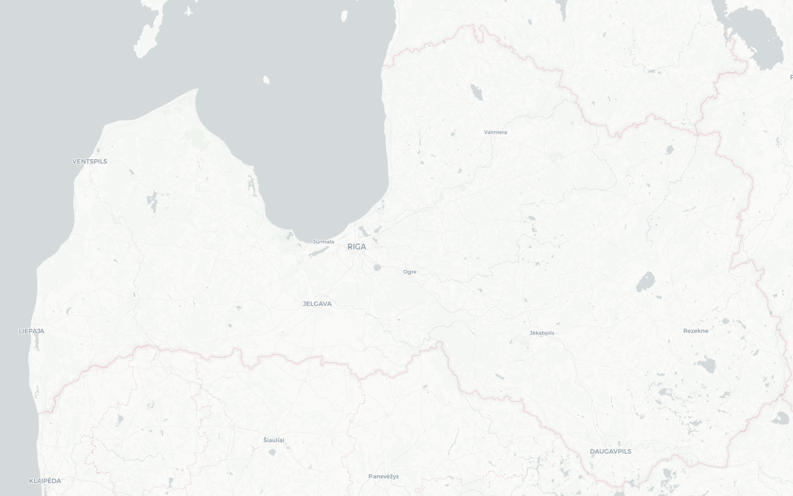
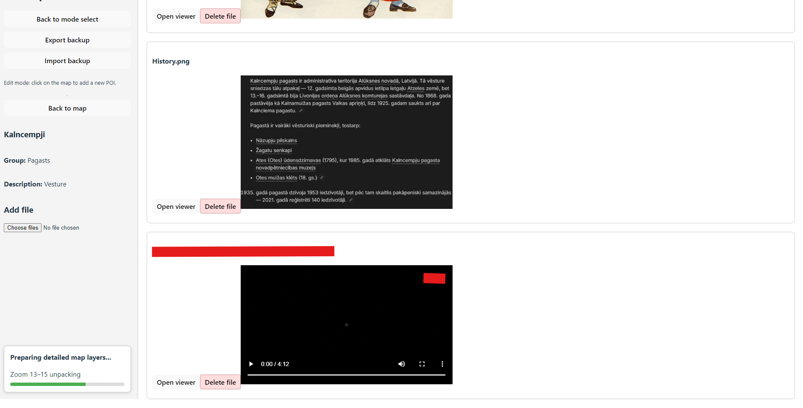
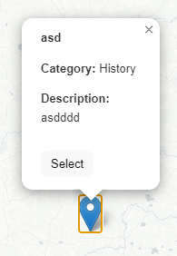
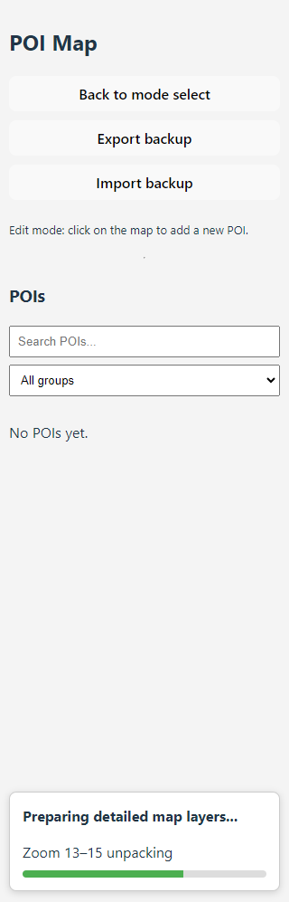

# Latvia POI Map
Setup Download from GoogleDrive English Version
- https://drive.google.com/file/d/1IUzIPSeFjvqYWfRnCFm3t6BHLrYQbGlp/view?usp=drive_link
A desktop-focused offline mapping application built with **React**, **TypeScript**, **Electron**, and **Vite**.

The application is designed for:
- offline spatial data viewing
- POI management
- local file attachments
- offline tile rendering
- lightweight desktop deployment

Built using:
- React Leaflet
- Leaflet
- Electron
- QGIS

---

# 🖼️ Screenshots

## Main Map View









## ✨ Features

### ✅ Completed

- Offline Latvia map support
- POI creation and editing
- Category-based colored map markers
- Attachment support
- File preview support
- Open files directly on PC
- Export / import backup system
- Offline tile extraction system
- Progressive background map loading
- Fast installer resource loading
- Automatic cleanup of unused files
- Desktop installer support
- Fullscreen desktop mode
- Local-first storage architecture
- Translation to Latvian

---

## 🗺️ Offline Maps Setup
Offline tiles are generated using QGIS.

### QGIS Tile Source Configuration

1. Open **QGIS**
Navigate to:
   - `XYZ Tiles`
   - `New Connection`

2. Configure the connection:
| Setting | Value |
|---|---|
| Name | `CartoDB Positron` |
| URL | `https://a.basemaps.cartocdn.com/light_all/{z}/{x}/{y}.png` |

3. Generate Tiles
- Recommended zoom levels: 8–15
- Export format: XYZ Tiles (PNG)

---

## ⚡ Performance Notes

The application uses several optimizations for offline maps:
- Externalized tilesets
- Background tile extraction
- Split zoom-level resource archives
- Progressive map loading
- Installer resource bundling
- Local caching in AppData

This allows:
- faster startup
- smaller installer overhead
- improved offline performance

---

📁 Local Data Storage

Application data is stored locally inside:
- AppData/Roaming/Latvia POI Map

Stored data includes:
- POIs
- attachments
- offline tile cache
- marker resources
- imported backups

---

## 🧰 Tech Stack

| Technology | Purpose |
|---|---|
| React | Frontend framework |
| TypeScript | Type safety |
| Electron | Desktop application framework |
| Vite | Fast build tooling |
| Leaflet | Interactive maps |
| React Leaflet | React integration for Leaflet |
| QGIS | Tile generation & GIS workflow |
| Electron Builder | Windows installer genertation |

---

## 🛣️ Roadmap

| Feature | Status |
|---|---|
| Offline maps | ✅ Completed |
| Backup system | ✅ Completed |
| Windows installer | ✅ Completed |
| Attachment system | ✅ Completed |
| Progressive tile extraction | ✅ Completed |
| Latvian translation | ✅ Completed |
---

## 📦 Getting Started

### Clone the repository

```bash
git clone https://github.com/JanisSpilva/React-POI.git
```

### Navigate to the project

```bash
cd React-POI
```

### Install dependencies

```bash
npm install
```

### Start development server

```bash
npm run dev
```

### Build production version

```bash
npm run dist
```

---

## 📁 Project Goals

This project aims to provide:
- fast offline-capable map rendering
- lightweight desktop deployment
- GIS-friendly workflows
- local-first architecture
- expandable spatial tooling
- simple backup management

---

## 🔗 Resources

- React Leaflet  
  https://react-leaflet.js.org/

- Leaflet  
  https://leafletjs.com/

- Leaflet Color Markers  
  https://github.com/pointhi/leaflet-color-markers

- QGIS  
  https://qgis.org/

- Vite  
  https://vitejs.dev/

- Electron  
  https://www.electronjs.org/

---

## 📄 License

This project is currently private / unlicensed.
